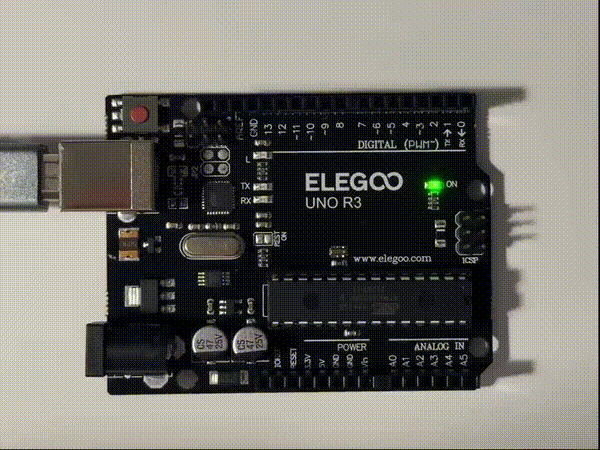
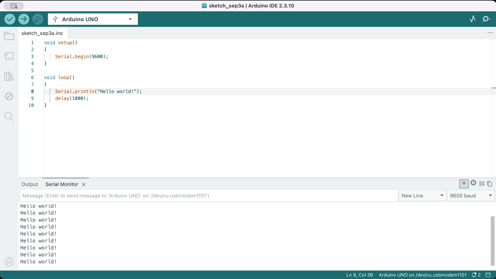

# Technology Design Foundations 

`Hui Liu · MDes @ UC Berkeley · Fall 2026`

Experiments, prototypes, and reflections across physical and computational design.

[Dr Sudhu's arduino tutorial](https://github.com/loopstick/ArduinoTutorial)

## Week 1

### Lecture - Sep 1
This week, I started working with Arduino and learned the basic structure of an Arduino program, including `setup()` and `loop()`, digital output, delays, and serial communication.

I worked through two introductory exercises: **[Blink](./physical-computing/week1/lecture/blink/blink.ino)** and **[Hello World](./physical-computing/week1/lecture/hello-world/hello-world.ino)**, then combined the two concepts into a short **[exercise](./physical-computing/week1/lecture/combine-blink-hello-world/combine-blink-hello-world.ino)**.

    
    

### Studio - Sep 3
