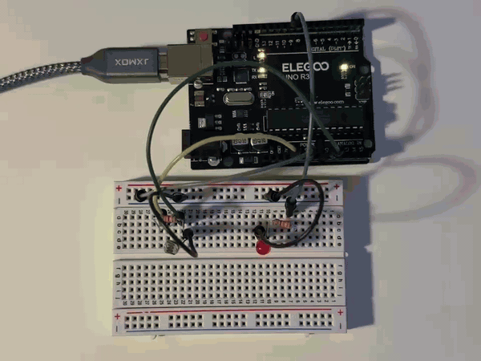
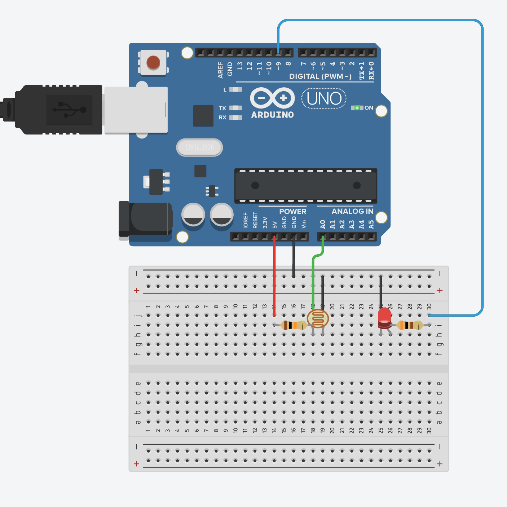
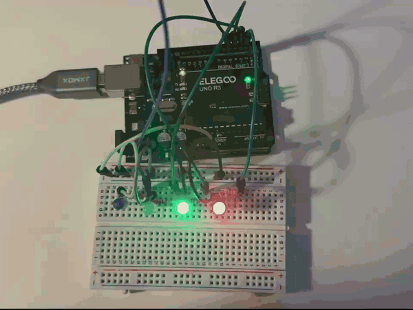
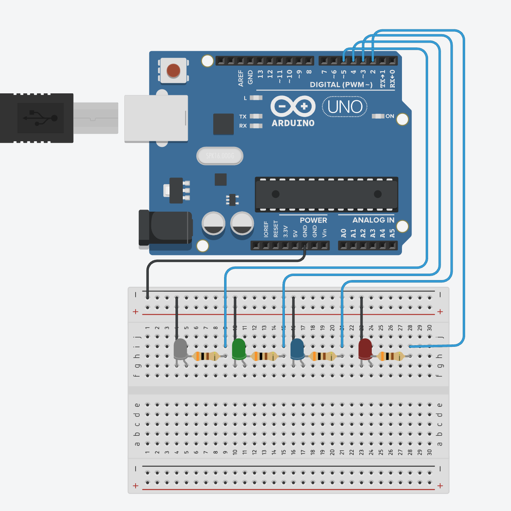
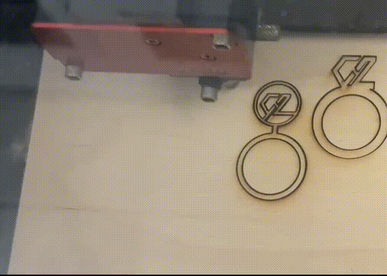
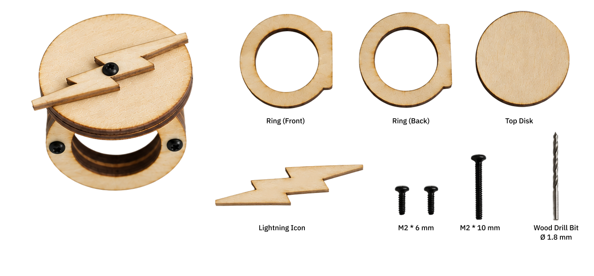

# Technology Design Foundations 

`Hui Liu · MDes @ UC Berkeley · Fall 2026`

Experiments, prototypes, and reflections across physical and computational design.

[Dr Sudhu's arduino tutorial](https://github.com/loopstick/ArduinoTutorial)

## Quick Navigation

| Week | Week | Week | Week |
| --- | --- | --- | --- |
| [Week 01](#week-01) | [Week 02](#week-02) | [Week 03](#week-03) | [Week 04](#week-04) |
| [Week 05](#week-05) | [Week 06](#week-06) | [Week 07](#week-07) | [Week 08](#week-08) |
| [Week 09](#week-09) | [Week 10](#week-10) | [Week 11](#week-11) | [Week 12](#week-12) |

 

## Week 1

### Lecture - Sep 1
This week, I started working with Arduino and learned the basic structure of an Arduino program, including `setup()` and `loop()`, digital output, delays, and serial communication.

I worked through two introductory exercises: **[Blink](./physical-computing/week1/lecture/blink/blink.ino)** and **[Hello World](./physical-computing/week1/lecture/hello-world/hello-world.ino)**, then combined the two concepts into a short **[exercise](./physical-computing/week1/lecture/combine-blink-hello-world/combine-blink-hello-world.ino)**.

    
    

---

I used an LDR to detect changes in ambient light and **[control an LED](./physical-computing/week1/lecture/ldr-control/ldr-control.ino)** based on the sensor value. The LDR circuit is connected to the analog input pin A0, and the LED turns on when the sensor value passes a selected threshold.

    
    

**Take Away**
- An LDR needs to be read through an analog input pin.
- `A0` represents the analog input pin and can be stored as an `int`.
- `analogRead()` reads the analog value from the pin and returns an integer value.
- `Serial.println()` can be used to observe the sensor values and determine a suitable threshold.

---

I used multiple LEDs to create a **[back-and-forth light sequence](./physical-computing/week1/lecture/more-leds/more-leds.ino)**. The LEDs light up one by one in forward order, then reverse direction and return to the beginning.

    
    

**Take Away**
- C++ arrays use `{}` instead of `[]` when initializing values.
- A basic C++ array does not have `.length()`.
- A `for` loop can be used to iterate through all LEDs in forward order.
- A second `for` loop can start from the end of the array and decrement the index to create the reverse sequence.
- Skipping the first and last LEDs in the reverse loop prevents the endpoint LEDs from lighting twice in a row.

### Studio - Sep 3

    
    

