# Technology Design Foundations 

`Hui Liu · MDes @ UC Berkeley · Fall 2026`

Experiments, prototypes, and reflections across physical and computational design.

[Dr Sudhu's arduino tutorial](https://github.com/loopstick/ArduinoTutorial)

## Quick Navigation

| Week | Week | Week | Week |
| --- | --- | --- | --- |
| [Week 02](#week-02) | [Week 03](#week-03) | [Week 04](#week-04) | [Week 05](#week-05) |
| Week 06 | Week 07 | Week 08 | Week 09 |
| Week 10 | Week 11 | Week 12 | |

 

## Week-05

### Expressive Mechanics: Laser Cutting, Part Testing & CV - Sep 22

[Fusion 360 model](./physical-computing/week5/cad/Robot_Face.f3d) and [Illustrator file](./physical-computing/week5/cad/Robot_Face.ai)

    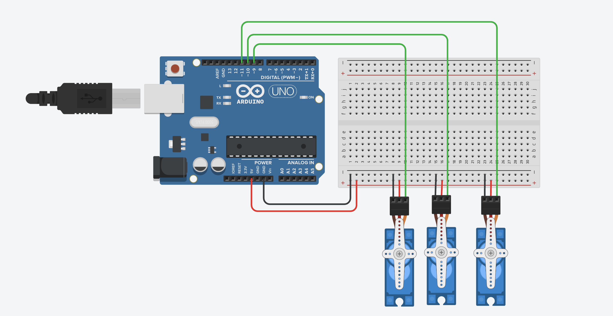
    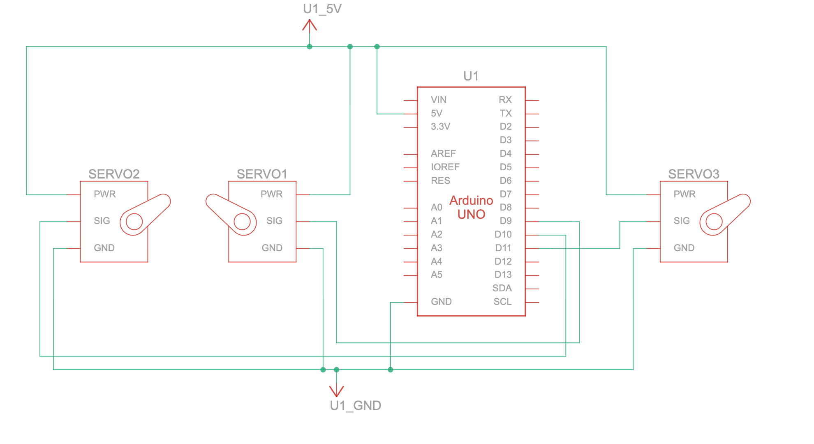

During the week, I moved to the makerspace and laser cut the parts for faster iteration. This made it easier to test different pivot and axis positions. I worked through the eyes, eyebrows, and mouth individually, adjusting each mechanism until all three could move reliably without interfering with one another. Only after the physical mechanisms were working independently did I begin integrating CV.

    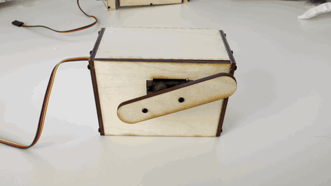
    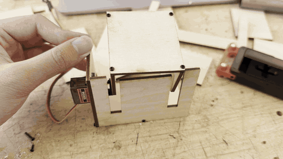
    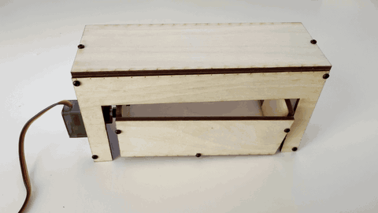

The **[p5.js sketch](./physical-computing/week5/code/P5_Code/sketch.js)** uses ml5 FaceMesh to detect eye closure, raised eyebrows, and an open mouth. After calibrating a neutral expression, it sends these states to Arduino through Web Serial.

    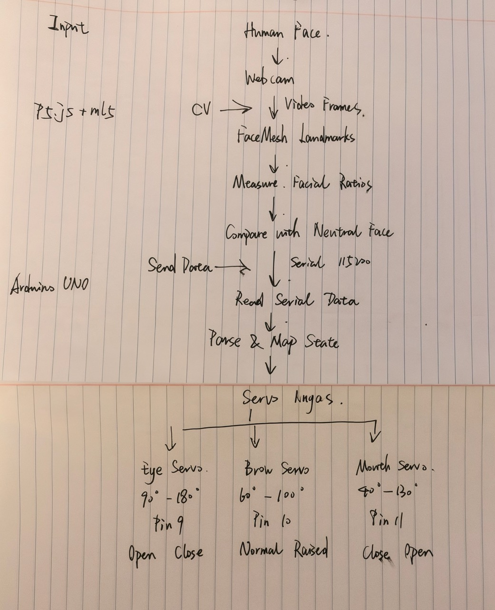

The **[Arduino code](./physical-computing/week5/code/Uno_Servo_Code/Uno_Servo_Code.ino)** translates the expression states into movements for three servos controlling the eyes, eyebrows, and mouth.

    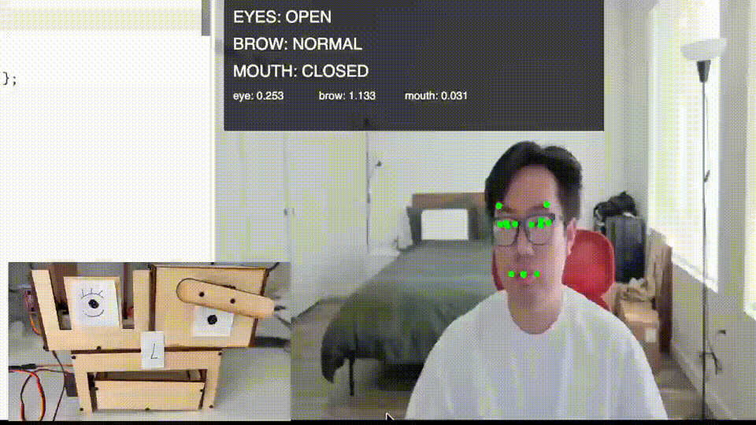

### Expressive Mechanics: Presentation Day - Sep 25

I presented the face-mirroring mechanism. During the presentation, a bug appeared: the eyebrow mechanism kept rotating without stopping. The cause is still unconfirmed, and the issue remains unresolved.

**Reflection**

Testing each facial movement separately helped me gradually refine the individual mechanisms. However, the eyebrow mechanism malfunctioned during the presentation. I suspect that multiple faces appearing in the camera frame at the same time may have triggered the bug, but I have not been able to reproduce it yet. This showed me that even when individual parts work, the complete system still needs more testing as a whole.

I also realized that using screws to assemble the outer shell added unnecessary complexity. A tab-and-slot joint would have made the enclosure easier to assemble, reduced the number of extra fasteners, and created a cleaner overall structure.

## Week-04

### Expressive Mechanics: Mechanical Research - Sep 15
This week, I started by exploring different types of mechanical movement because I was not yet sure what I wanted to make for the project. I looked through many examples of automata and focused on mechanisms such as cams, linkages, cranks, and ways of translating rotational motion into other forms of movement.

I also read Cabaret Mechanical Movement: Understanding Movement and Making Automata. The book helped me understand how relatively simple mechanical structures can generate expressive and sometimes surprisingly complex movements.

    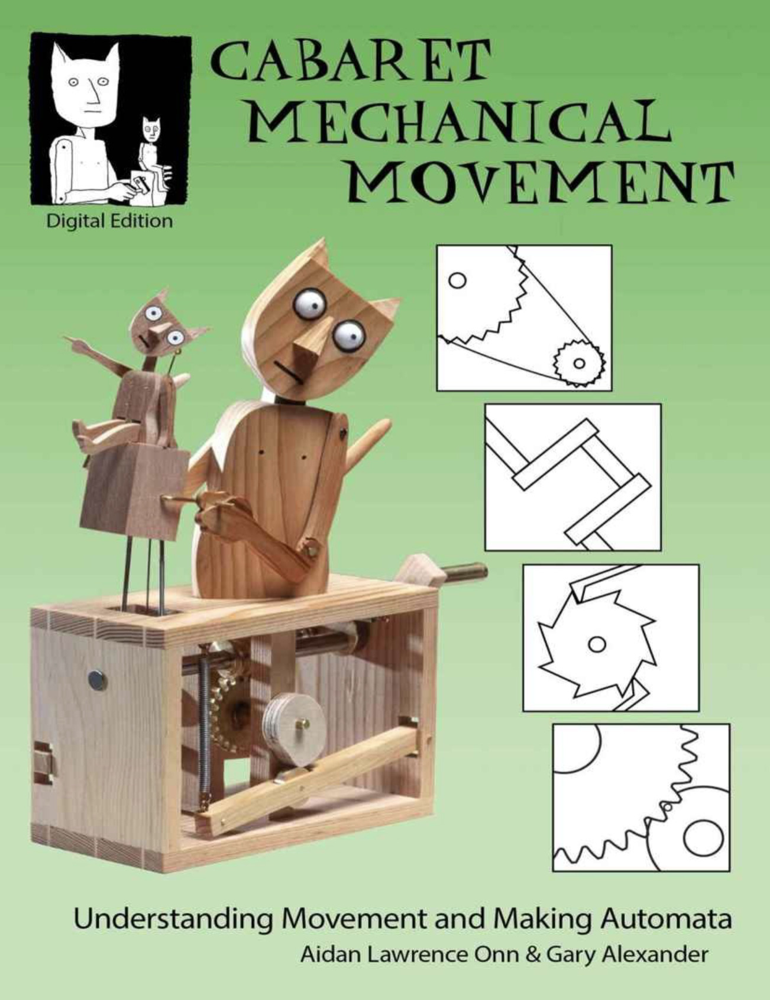

Alongside these references, I watched different mechanical and automata examples on YouTube and made a few sketches of mechanisms that I found interesting. At this stage, I was mainly trying to build a vocabulary of mechanical movement and understand what kinds of motion I could potentially use in my own project.

    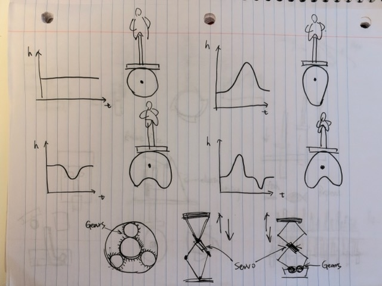
    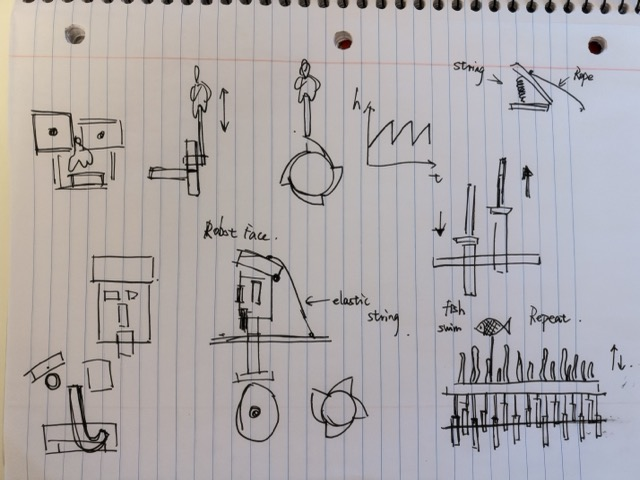

### Expressive Mechanics: 3D-Printed Prototype Testing - Sep 18

After exploring different mechanical movements, I decided to create a face-mirroring mechanism with three servos. Each servo controls one facial feature: the eyelids, eyebrows, and mouth. 

I first tested each facial part separately before combining everything into one system. Since the makerspace was closed over the weekend and I could not use the laser cutter, I tested 3D-printed prototypes at home to check the geometry and servo motion.

One of the main problems was mechanical interference. As the servos rotated, the eyelids and mouth sometimes collided with nearby parts, preventing them from completing their full range of motion. I repeatedly adjusted the geometry, clearances, and servo angles to understand how much space each mechanism needed.

    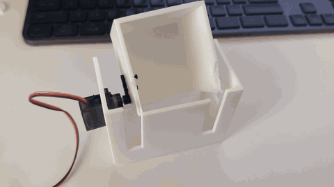

**Reflection**

The mechanism sketches helped me explore different types of movement, but the physical prototypes revealed many collisions I had not anticipated. This made me pay closer attention to the space each component actually needs throughout its full range of motion.

## Week-03

### Electronic - Sep 8
I built a **[simple interaction](./physical-computing/week3/electronics/ultrasounds-servo-motor/ultrasounds-servo-motor.ino)** using an ultrasonic sensor and a servo motor. The ultrasonic sensor measures the distance of an object, and the servo responds based on that distance.

When an object comes within 20 cm, the servo rotates to 90°. When the object moves away, it returns to 0°.

    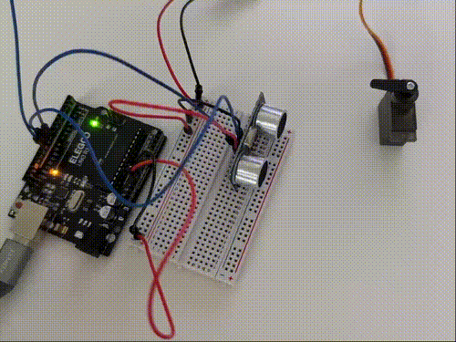
    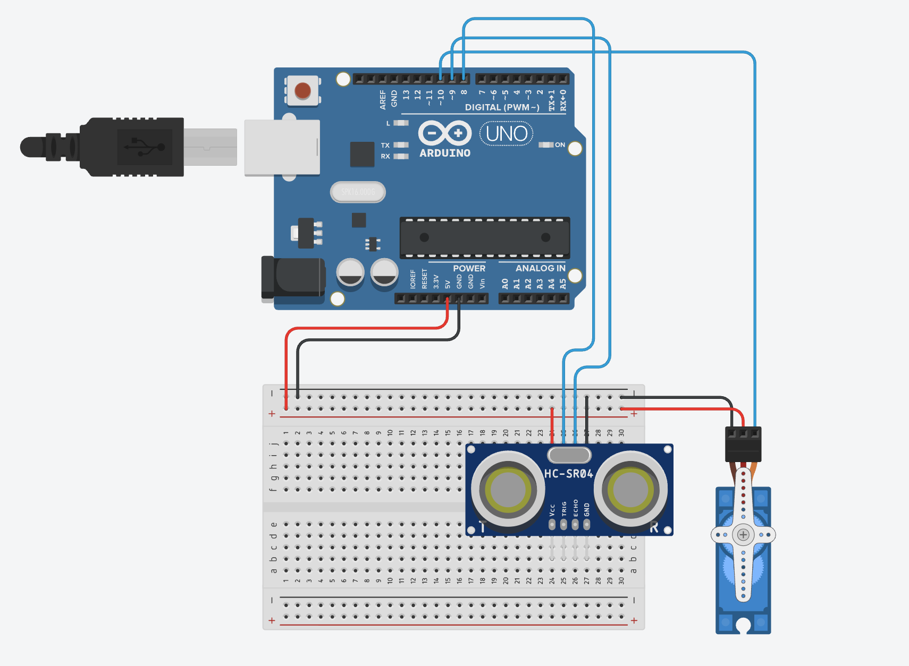
    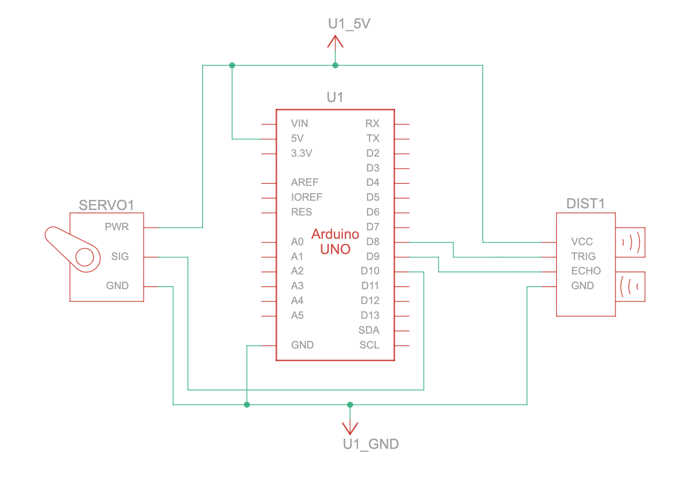

### Fabrication - Sep 17
This week, I explored 3D printing through two different ring-making approaches.

The first one was a Flash ring, based on the ring I made in the previous laser-cutting exercise. Since the overall form was relatively simple, I drew the profile directly in a sketch and extruded it into a 3D form. After separating the ring into different parts, I added M2 holes at the connection points so that the pieces could be assembled after printing.

    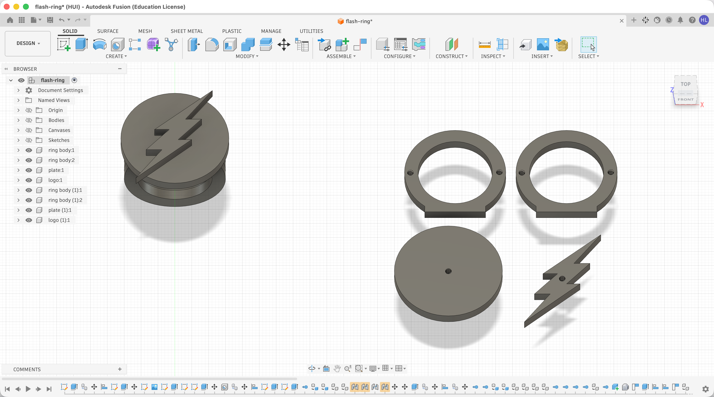

The second one was an organic ring made in Grasshopper. I started by creating a circle and extracting points along the curve, then rebuilt it with more points. I used random values to distribute the points around the circle and along the Z-axis, and moved them to create a second, more irregular circular profile. I then lofted the two profiles together to generate the main form. After that, I extracted the UV space of the surface, created a Voronoi pattern on it, and mapped the pattern back onto the curved geometry.

    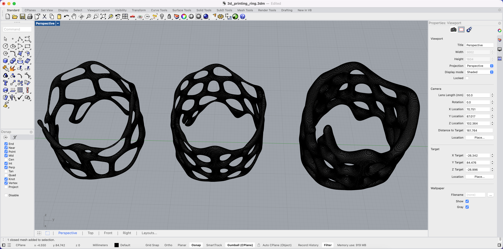
     
    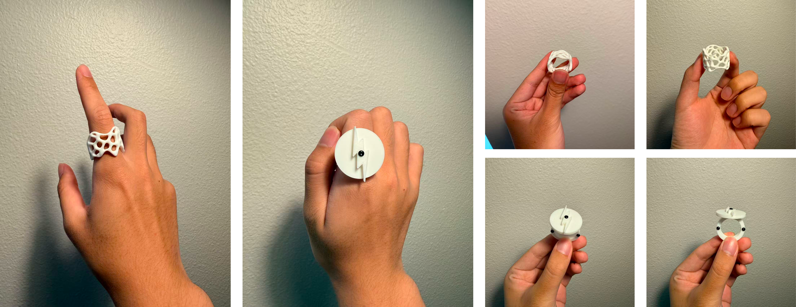

## Week-02

### Electronic - Sep 1
This week, I started working with Arduino and learned the basic structure of an Arduino program, including `setup()` and `loop()`, digital output, delays, and serial communication.

I worked through two introductory exercises: **[Blink](./physical-computing/week2/electronics/blink/blink.ino)** and **[Hello World](./physical-computing/week2/electronics/hello-world/hello-world.ino)**, then combined the two concepts into a short **[exercise](./physical-computing/week2/electronics/combine-blink-hello-world/combine-blink-hello-world.ino)**.

    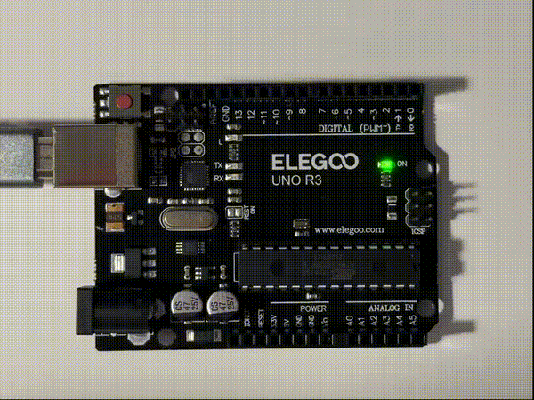
    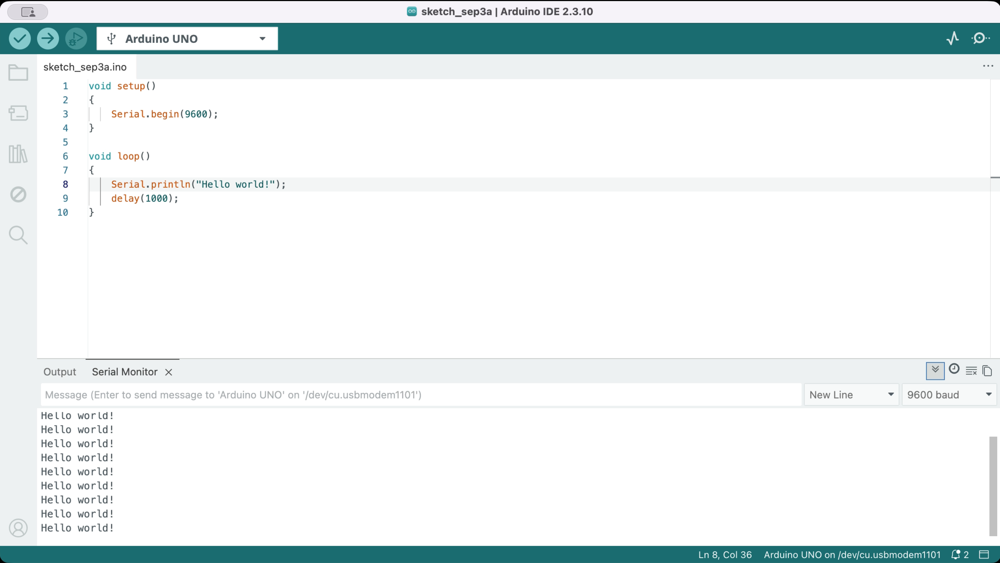

---

I used an LDR to detect changes in ambient light and **[control an LED](./physical-computing/week2/electronics/ldr-control/ldr-control.ino)** based on the sensor value. The LDR circuit is connected to the analog input pin A0, and the LED turns on when the sensor value passes a selected threshold.

    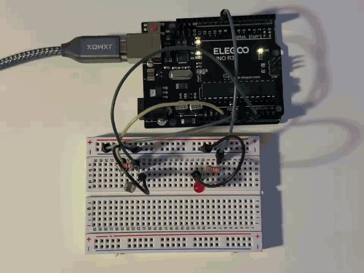
    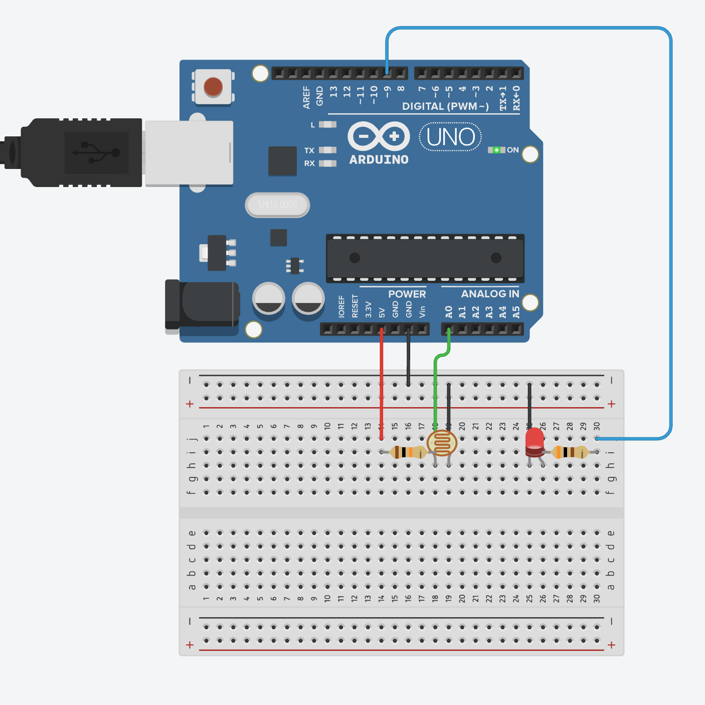

**Take Away**
- An LDR needs to be read through an analog input pin.
- `A0` represents the analog input pin and can be stored as an `int`.
- `analogRead()` reads the analog value from the pin and returns an integer value.
- `Serial.println()` can be used to observe the sensor values and determine a suitable threshold.

---

I used multiple LEDs to create a **[back-and-forth light sequence](./physical-computing/week2/electronics/more-leds/more-leds.ino)**. The LEDs light up one by one in forward order, then reverse direction and return to the beginning.

    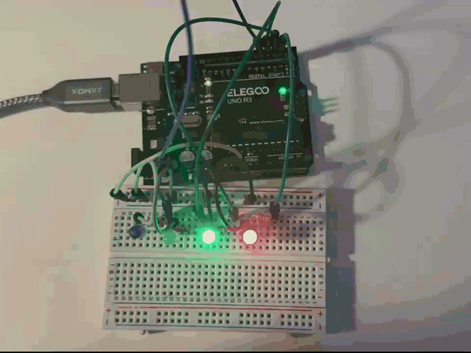
    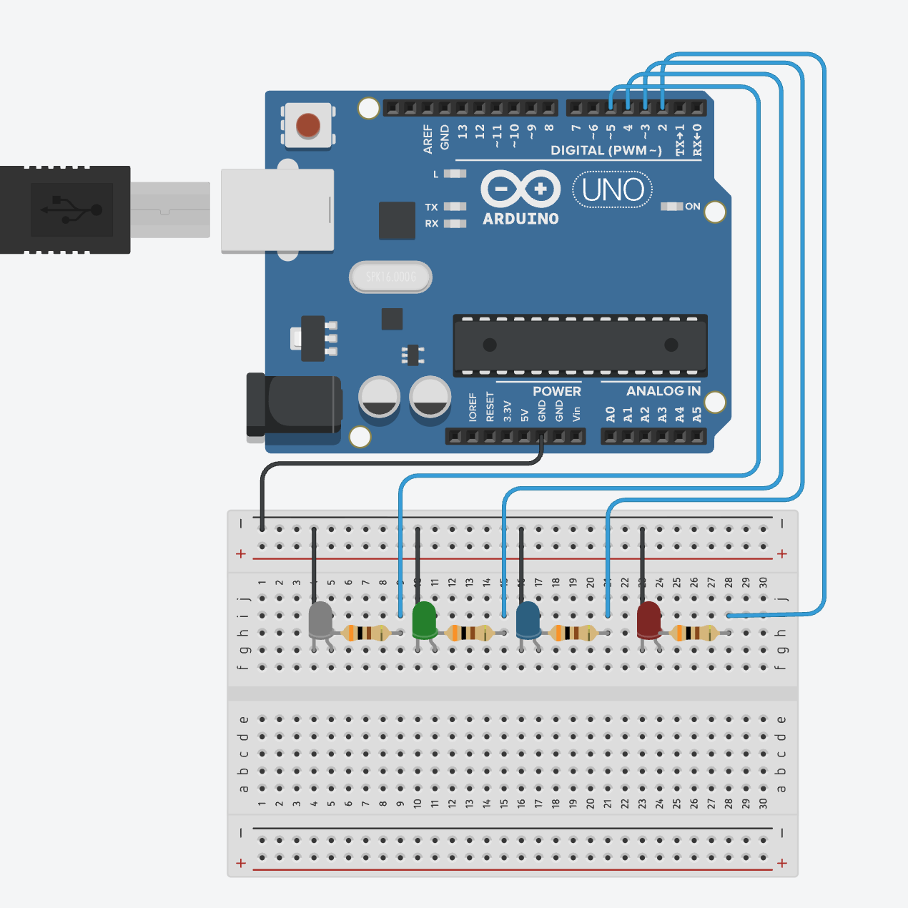

**Take Away**
- C++ arrays use `{}` instead of `[]` when initializing values.
- A basic C++ array does not have `.length()`.
- A `for` loop can be used to iterate through all LEDs in forward order.
- A second `for` loop can start from the end of the array and decrement the index to create the reverse sequence.
- Skipping the first and last LEDs in the reverse loop prevents the endpoint LEDs from lighting twice in a row.

### Fabrication - Sep 3

For this exercise, I wanted to make something more playful than a conventional ring, so I designed a Flash-inspired ring with a lightning-bolt element on top.

I first designed the parts as 2D profiles for laser cutting and adjusted the dimensions based on the thickness of the wood and the size of my finger. After cutting the pieces, I assembled them with small M2 screws and tested how the parts fit and move together.

    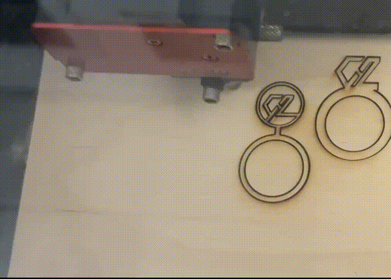
    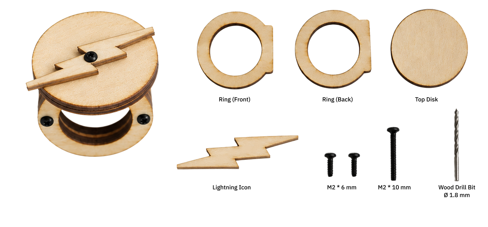

